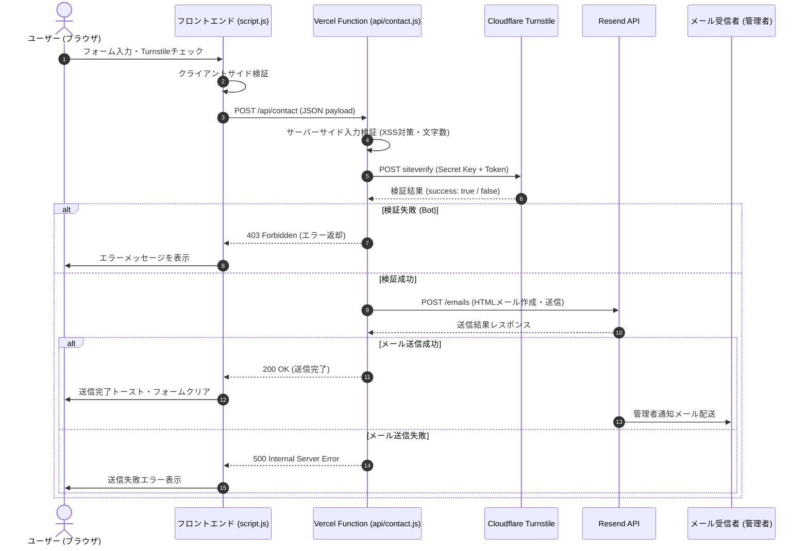

# AstraNova eスポーツチーム公式サイト - API設計書

本ドキュメントは、AstraNova公式サイトのお問い合わせフォームから送信されるデータを処理するVercel Serverless Function (`api/contact.js`) の仕様を定義したものです。

---

## 1. エンドポイント定義

* **パス**: `/api/contact`
* **メソッド**: `POST`
* **Content-Type**: `application/json`

---

## 2. リクエスト仕様

### 2.1. リクエストボディ (JSON)
フロントエンドから以下の形式でデータを送信します。

```json
{
  "name": "山田 太郎",
  "email": "yamada@example.com",
  "subject": "スポンサー加入について",
  "message": "AstraNovaの活動に協賛したく、資料を送付いただけますでしょうか。",
  "turnstileToken": "0.XT4...xxxxx"
}
```

### 2.2. 各パラメータの検証ルール
サーバーサイドで以下のバリデーションを厳密に実施します。

* **`name`**:
  - 必須。
  - 型: 文字列
  - 長さ: 1文字以上100文字以下
* **`email`**:
  - 必須。
  - 型: 文字列
  - フォーマット: RFC準拠の電子メール正規表現パターン
* **`subject`**:
  - 必須。
  - 型: 文字列
  - 長さ: 1文字以上100文字以下
* **`message`**:
  - 必須。
  - 型: 文字列
  - 長さ: 10文字以上2000文字以下
* **`turnstileToken`**:
  - 必須。
  - 型: 文字列
  - 内容: Cloudflare Turnstileより生成されたチェック用トークン

---

## 3. レスポンス仕様

通信結果は一貫したJSONフォーマットで返却します。

### 3.1. 成功時 (200 OK)
フォーム送信、Turnstile検証、およびResendメール送信が正常に完了した場合。

```json
{
  "success": true,
  "message": "お問い合わせが正常に送信されました。"
}
```

### 3.2. バリデーションエラー (400 Bad Request)
送信されたパラメータに不備がある場合。

```json
{
  "success": false,
  "error": "VALIDATION_ERROR",
  "message": "入力データが不正です。",
  "details": {
    "email": "無効なメールアドレス形式です。"
  }
}
```

### 3.3. Bot検出 / Turnstileトークン検証失敗 (403 Forbidden)
Turnstileトークンの検証がCloudflare側で却下された場合。

```json
{
  "success": false,
  "error": "SPAM_DETECTED",
  "message": "セキュリティチェックに失敗しました。Botと判定された可能性があります。"
}
```

### 3.4. 許可されていないメソッド (405 Method Not Allowed)
`GET`, `PUT`, `DELETE` など `POST` 以外のメソッドでアクセスされた場合。

```json
{
  "success": false,
  "error": "METHOD_NOT_ALLOWED",
  "message": "許可されていないリクエストメソッドです。"
}
```

### 3.5. サーバーエラー (500 Internal Server Error)
Resend API呼び出しの失敗、環境変数の未設定など、内部処理に致命的な問題が生じた場合。

```json
{
  "success": false,
  "error": "INTERNAL_SERVER_ERROR",
  "message": "サーバー内部でエラーが発生しました。時間を置いて再度お試しください。"
}
```

---

## 4. 内部処理シーケンス


